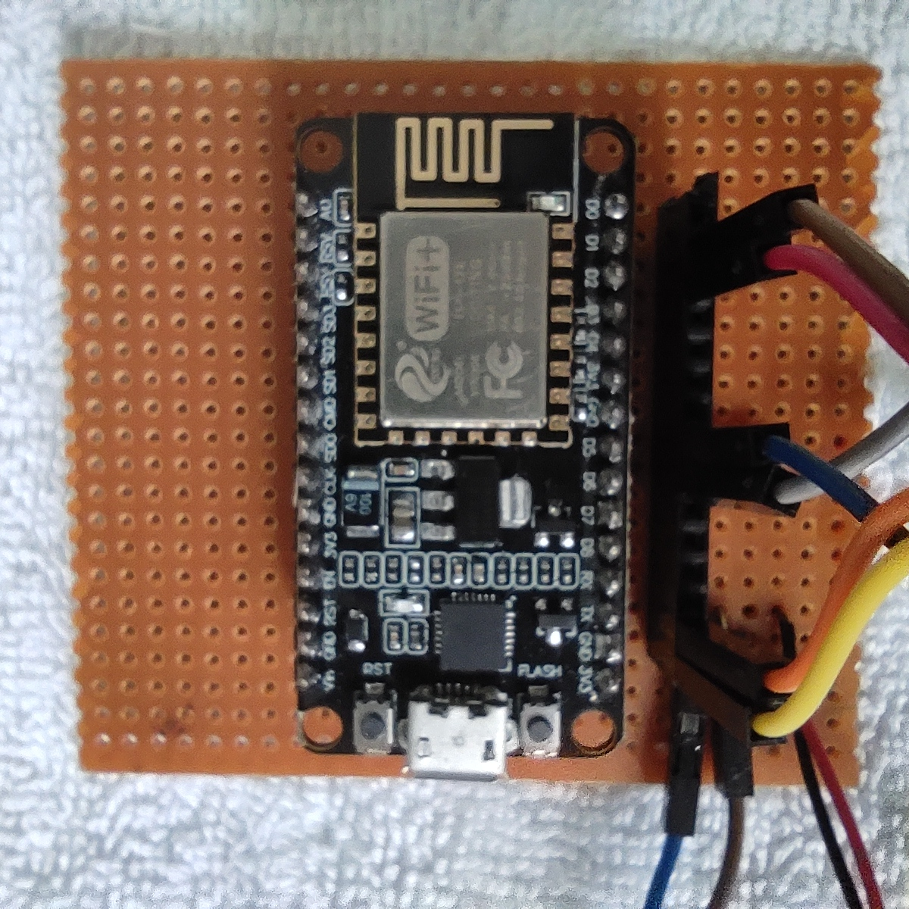
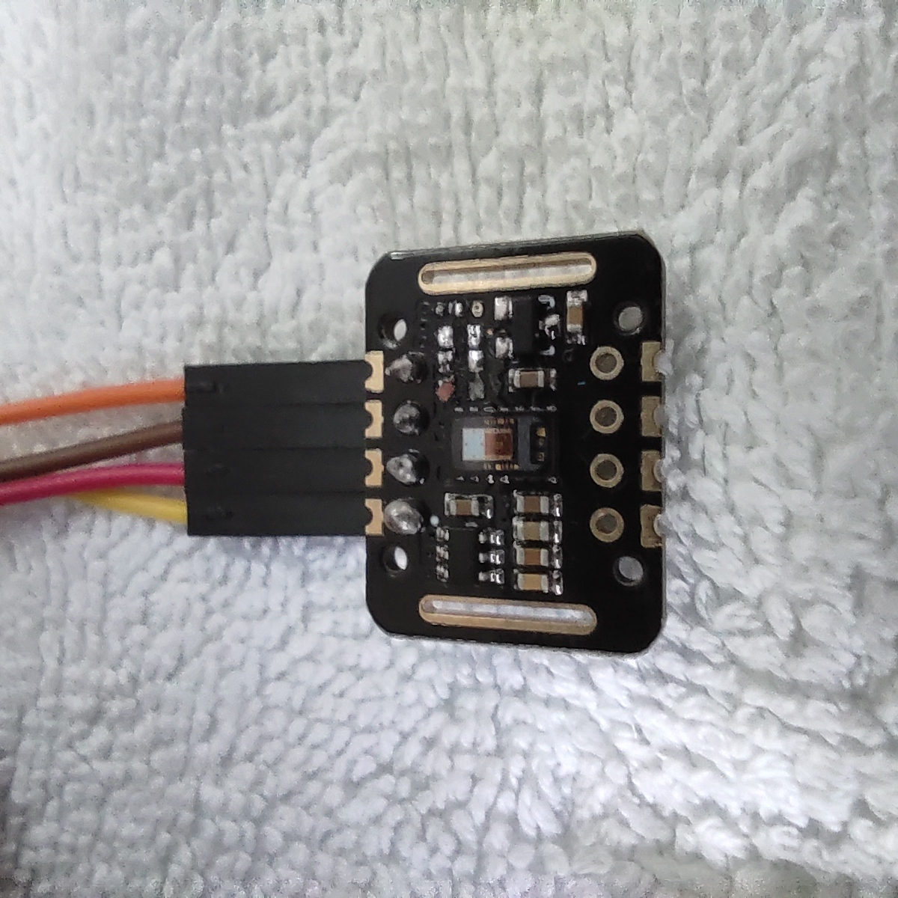
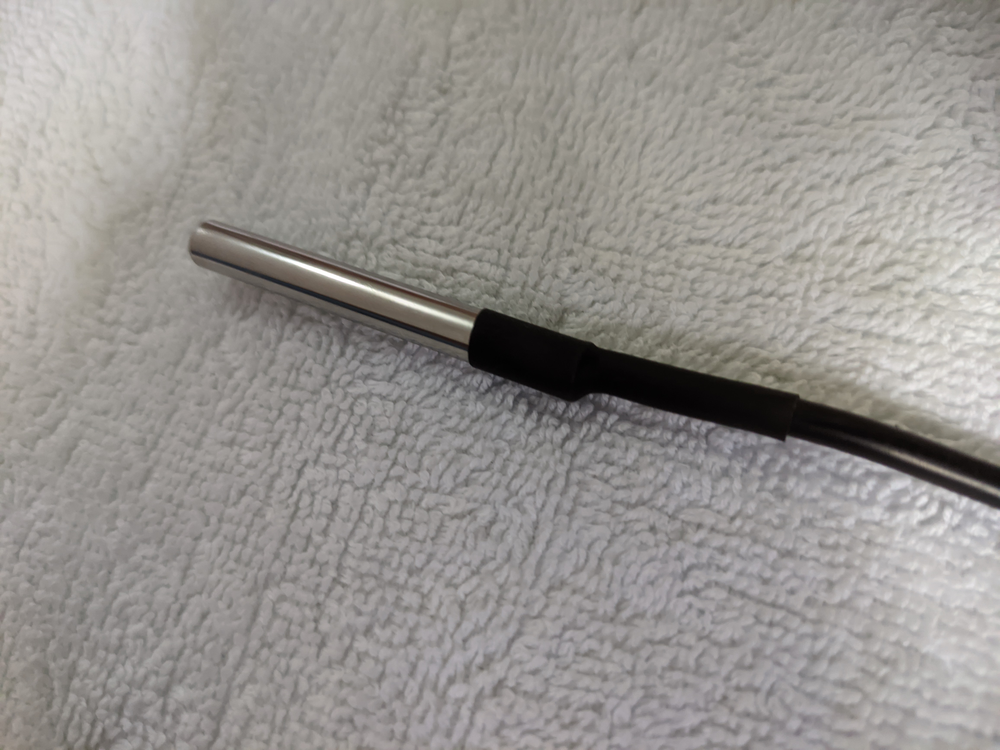

# Remote Patient Monitoring System
Remote Patient Monitoring System Designed and Coded to fulfill the requirements for the Individual Design Project of the Bachelors Degree

## Required Components

- Node MCU (ESP 8266)

- Pulse Oximeter Sensor (Heart Rate/SpO2)

- Temperature Sensor (DS18B20)

